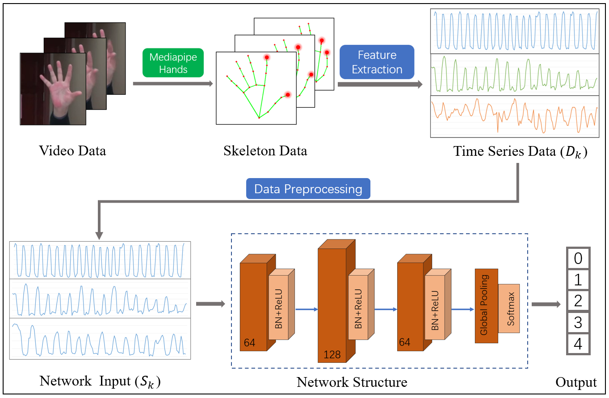

# CNN-for-PD-action
The flow chart of the finger tapping evaluation method proposed in this paper is shown in figure . 

Firstly, the finger tapping test video of PD patients is collected, and then the skeleton data of the hands is extracted by the pose estimation model MediapipeHands[[[2006.10214v1\] MediaPipe Hands: On-device Real-time Hand Tracking (arxiv.org)](https://arxiv.org/abs/2006.10214v1)]. 

Subsequently, the feature data based on the motion law of the hands is extracted depending on the method designed in this paper, so as to obtain the one-dimensional time series data. 

Following the data pre-processing such as normalization and cropping alignment, the data are input into the full convolution network(FCN).



## Data 

The data used to support the findings of this study are available from the corresponding author upon request.If necessary, the researcher can send an email to [caimiao1985@126.com](mailto:caimiao1985@126.com).

## Code 

The code is divided as follows: 

* The MediapipeHand.py python file used to extract hand skeleton information. 
* The FCN.py  python file is the network used to evaluate the experiment.
* The Feature.py python file used to extract velocity and amplitude information

To run a model on one dataset you should issue the following command: 

```
python FCN.py 
```

## Prerequisites

All python packages needed are listed in pip-requirements.txt  file and can be installed simply using the pip command. 
The code now uses Tensorflow 1.11.0.

## Acknowledgement

This work was supported by the Zhejiang Provincial Key Lab of Equipment Electronics，Hangzhou, China. This project was also supported by the grants from Zhejiang Health New Technology Product Research and Development Project (2021PY034), Zhejiang Medicine and Health Science and Technology Project (2021KY420) and Medical health Science and Technology project of Zhejiang (2020366842).


